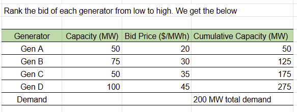
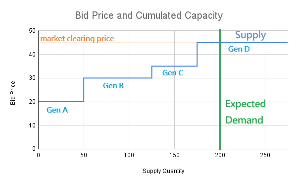

# ⚡ How Bidding & Pricing Work in Wholesale Power Markets

Most people who’ve taken an intro economics class or AP Economics will remember drawing supply and demand curves to explain how prices adjust the quantities — the classic “invisible hand” of the market.

Here, we’ll build on that familiar idea to explore how pricing works in **deregulated wholesale electricity markets**, with a warm-up example using something everyone understands: parking spaces!

---

## 🚗 Parking Lot Example: A Simple Auction

Imagine an apartment building with 20 households but only 10 parking spots for rent. How should the Resident Management Committee decide who gets a spot and at what price?

Here’s one fair and efficient way:  

✅ **Step 1: Residents submit bids**  
Each household writes down how many parking spots they want and the maximum they’re willing to pay for each spot per year.

✅ **Step 2: Auction run by the Committee**  
The committee stacks bids from highest to lowest — this creates a **demand curve**.  
Since the supply is fixed (10 spots), the highest bidders win.  
Everyone who gets a spot pays the same price — the **market clearing price** — which is the bid of the last person needed to fill the 10 spots.

The difference between what each household was willing to pay and what they actually pay is their **consumer surplus** — the economic “bonus” of paying less than you were willing to.

---

## 🌐 Internet Service Analogy: Congestion Pricing

This same idea can be used by an Internet Service Provider (ISP) to manage limited bandwidth — each customer’s packets can get priority based on what they’re willing to pay during peak hours.

This shows how auction mechanisms help allocate a fixed supply efficiently when demand fluctuates.

---

## ⚡ Now, What About Electricity?

In a **deregulated wholesale electricity market**, the model works in the opposite direction:  
- Instead of a fixed supply meeting flexible demand, the demand is forecasted and relatively fixed (in the short term),  
- And generators compete to supply that demand at the lowest possible cost.

Here, the **producers** benefit from the “extra” they earn when the clearing price is higher than their bid — this is called **producer surplus**.

---

## ⚙️ How a Wholesale Electricity Market Works (Step-by-Step)

✅ **Step 1: Generators submit bids**  
Each generator bids how much power they can supply and the minimum price ($/MWh) they’ll accept.

✅ **Step 2: Buyers forecast demand**  
Load-serving entities (utilities, aggregators) submit their expected demand for each hour.

✅ **Step 3: The ISO/RTO runs the auction**  
The market operator (like MISO) stacks the supply bids from lowest to highest cost — creating a **supply curve**.  
Where that supply curve meets forecasted demand sets the **market clearing price**.

## 📊 Example: Merit Order Dispatch

> Below is a simple example of how bids stack up:
>
> 
>
> 
>
> *Figure: Generators are dispatched in order of increasing price until demand is met. The last unit needed sets the marginal price.*

✅ **Step 4: Dispatch**  
Generators are dispatched in merit order, from lowest cost to highest, until demand is met.  
All cleared generators are paid the **marginal price** — the bid of the last generator needed.

✅ **Step 5: Real-time balancing**  
Real-time markets adjust dispatch every few minutes to handle forecast errors or sudden changes.

✅ **Step 6: Settlements & LMPs**  
Payments and charges are settled: generators get paid the clearing price, buyers pay that price.  
Because the grid has transmission constraints and losses, the final price can vary by location — this is called **Locational Marginal Pricing (LMP)**.

---

## 🧮 Key Terms Explained

- **Uniform price auction:** All sellers who clear the auction get paid the same market clearing price — common in electricity markets.
- **Pay-as-bid auction:** Each seller is paid what they bid — less common for wholesale power but used in some contexts.
- **Marginal pricing:** The price is set by the cost of supplying the last (marginal) unit needed to meet demand. Please see it in cost analysis page.
- **Locational Marginal Pricing (LMP):** The price at each location reflects the marginal cost of supplying an extra unit of power there, considering generation cost, transmission congestion, and losses.

---

## ✏️ What’s Next?

📄 Next, let's explore **[cost structures](./market-costs.md)** like LCOE affect bidding strategies, and how different buyers respond to prices.
[⬅ Back to Projects](./projects.md)
